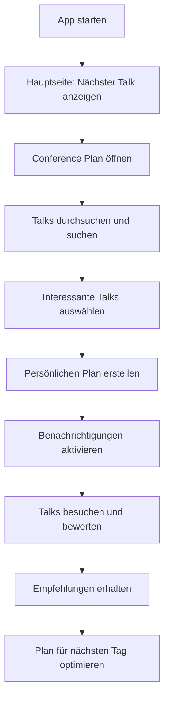

# NdcApp - Conference Planning Application

[](https://github.com/rsutter98/NdcApp/actions/workflows/ci-cd.yml)
[](https://github.com/rsutter98/NdcApp/actions)
[](#-deployment)
[](#license)

A .NET MAUI cross-platform application for conference planning and session management.

Eine .NET MAUI-Anwendung zur Planung und Verwaltung von Konferenzteilnahmen.

## 📚 Documentation

- **📖 [Complete Documentation](docs/README.md)** - Organized documentation structure
- **🚀 [Quick Start Guide](docs/user-guide/QUICK_START.md)** - Get started in 5 minutes
- **👨‍💻 [Developer Guide](docs/developer-guide/README.md)** - Development setup and guidelines
- **🔧 [Build Instructions](BUILD.md)** - How to build and deploy
- **📋 [User Manual](BENUTZERHANDBUCH.md)** - Detailed user guide (German)

## 🎯 Quick Overview

NdcApp helps conference attendees plan their schedule, discover talks, and manage their conference experience efficiently.

### ✨ Key Features

- **🗂️ CSV Import**: Load conference talks from CSV files
- **📅 Talk Selection**: Choose interesting talks for your personal schedule
- **🔄 Smart Sorting**: Sort by speaker, category, time, or rating
- **💾 Auto-Save**: Your selections are automatically persisted
- **⏰ Next Talk**: See at a glance which talk is coming up next
- **🎨 NDC Design**: Beautiful UI with authentic NDC corporate design
- **⭐ Talk Ratings**: Rate talks and see community ratings
- **🔍 Advanced Search**: Find talks by title, speaker, category, or room
- **🔔 Notifications**: Get reminded about upcoming talks
- **📱 Cross-Platform**: Works on Windows, Android, and iOS

## 📱 Screenshots und UI-Übersicht

### Hauptseite (Main Page)
Die Startseite der App begrüßt Sie im eleganten NDC-Design mit dunkelblauen und gelben Akzentfarben:

```
┌─────────────────────────────────────────┐
│              [NDC Logo]                 │
│                                         │
│           NDC Copenhagen               │
│    Experience the future of software!  │
│                                         │
│  ┌─────────────────────────────────┐    │
│  │   Current Time: 09:00           │    │
│  │   Next Talk: Keynote: AI is     │    │
│  │   having its moment ... again   │    │
│  └─────────────────────────────────┘    │
│                                         │
│    [Go to My Conference Plan]          │
│                                         │
└─────────────────────────────────────────┘
```

**Features der Hauptseite:**
- **Aktuelle Zeit**: Zeigt die aktuelle Uhrzeit an
- **Nächster Talk**: Übersicht über den nächsten geplanten Talk
- **NDC-Branding**: Authentisches NDC Copenhagen Design
- **Zentrale Navigation**: Direkter Zugang zum Conference Plan

### Conference Plan Seite
Die Hauptarbeitsseite für die Talk-Verwaltung:

```
┌─────────────────────────────────────────┐
│           Conference Plan               │
│                                         │
│  [Search talks, speakers, categories...] │
│                                         │
│ [Alle Talks] [Meine Talks] [🔔] [Sort▼] │
│                                         │
│  ┌─────────────────────────────────┐    │
│  │  Keynote: AI is having its...   │    │
│  │  Jodie Burchell                 │    │
│  │  ⭐⭐⭐⭐⭐ (5.0)               │    │
│  │  Wednesday                      │    │
│  │  09:00                          │    │
│  │        [Select Talk]            │    │
│  └─────────────────────────────────┘    │
│                                         │
│  ┌─────────────────────────────────┐    │
│  │  Java Sucks (So C# Didn't Have │    │
│  │  To)                            │    │
│  │  Adele Carpenter                │    │
│  │  ⭐⭐⭐⭐☆ (4.2)               │    │
│  │  Wednesday                      │    │
│  │  10:20                          │    │
│  │        [Select Talk]            │    │
│  └─────────────────────────────────┘    │
│                                         │
└─────────────────────────────────────────┘
```

**Features der Conference Plan Seite:**
- **Suchfunktion**: Volltextsuche über Titel, Sprecher und Kategorien
- **Filter-Buttons**: Schneller Wechsel zwischen allen Talks und persönlicher Auswahl
- **Benachrichtigungen**: Zugang zu Push-Notification-Einstellungen  
- **Sortierung**: Verschiedene Sortieroptionen (Standard, Presenter, Kategorie, Rating)
- **Talk-Karten**: Übersichtliche Darstellung jedes Talks mit:
  - Talk-Titel und Sprecher
  - Bewertungssystem (5-Sterne-Rating)
  - Zeitangaben (Tag und Uhrzeit)
  - Auswahl-Buttons für persönlichen Plan
- **Swipe-Gesten**: Wischen nach rechts für schnelle Talk-Auswahl
- **Pull-to-Refresh**: Ziehen Sie nach unten um Daten zu aktualisieren

## 🏗️ Project Structure

```
NdcApp/
├── NdcApp/                 # Main MAUI Application
│   ├── MainPage.xaml       # Start page with next talk info
│   ├── ConferencePlanPage.xaml # Talk selection and management
│   └── Converters/         # UI Converters
├── NdcApp.Core/           # Business Logic Library
│   ├── Models/            # Talk data model
│   └── Services/          # CSV service, plan service
├── NdcApp.Preview/        # Blazor Web Preview
├── NdcApp.Tests/          # Comprehensive Test Suite (99 tests)
└── docs/                  # Organized Documentation
```

### 🧪 Test Coverage
- **99 Tests** - All passing ✅
- **6 Test Classes** - Comprehensive coverage
- **Integration Tests** - End-to-end scenarios
- **Unit Tests** - All business logic covered
- **Real Data Tests** - Validated with actual NDC data

## 🚀 Quick Start

### Installation
Download the latest release for your platform:

- **Windows**: Download `.msix` from [Releases](https://github.com/rsutter98/NdcApp/releases)
- **Android**: Download `.apk` from [Releases](https://github.com/rsutter98/NdcApp/releases)
- **iOS**: Use TestFlight or install via Xcode

> **📋 Detailed Instructions**: See [Installation Guide](docs/user-guide/INSTALLATION.md) for step-by-step instructions.

### First Steps
1. **Launch the app** - Start NdcApp on your device
2. **Main page** - You'll see the current time and your next talk
3. **Conference Plan** - Tap "Go to My Conference Plan" to manage talks
4. **Search & Select** - Find interesting talks and add them to your schedule

> **📖 Complete Guide**: For detailed usage instructions, see [User Manual](BENUTZERHANDBUCH.md) (German) or [User Guide](docs/user-guide/README.md) (English).

## 🔧 For Developers

### Prerequisites
- .NET 8.0 SDK
- Visual Studio 2022 or VS Code
- MAUI Workloads installed

### Build & Run
```bash
# Clone the repository
git clone https://github.com/rsutter98/NdcApp.git
cd NdcApp

# Restore dependencies and build
dotnet build

# Run tests
dotnet test

# Run the app (specific platform)
dotnet run --project NdcApp/NdcApp.csproj
```

> **🔧 Detailed Setup**: See [Developer Guide](docs/developer-guide/README.md) for complete development setup.

---

## 📖 Detailed User Guide (German)

**1. App-Start**
- Starten Sie die NdcApp auf Ihrem Gerät
- Sie landen automatisch auf der Hauptseite mit der aktuellen Zeit und dem nächsten Talk

**2. Conference Plan öffnen**
- Tippen Sie auf "Go to My Conference Plan" um zur Hauptarbeitsseite zu gelangen
- Hier sehen Sie alle verfügbaren Talks der Konferenz

### Talk-Verwaltung

**Talks durchsuchen:**
- Verwenden Sie die Suchleiste am oberen Rand
- Suchen Sie nach:
  - Talk-Titeln (z.B. "AI", "Machine Learning")
  - Sprechernamen (z.B. "Jodie Burchell")
  - Kategorien (z.B. "Backend", "Frontend")
  - Räumen (z.B. "Room 1", "Room 2")

**Talks auswählen:**
- **Methode 1**: Tippen Sie auf den "Select Talk" Button unter einem Talk
- **Methode 2**: Wischen Sie einen Talk nach rechts und tippen auf "Select"
- Ausgewählte Talks werden in Ihrem persönlichen Plan gespeichert

**Filter verwenden:**
- **"Alle Talks"**: Zeigt sämtliche verfügbare Talks
- **"Meine Talks"**: Zeigt nur Ihre ausgewählten Talks
- **Sortierung**: Wählen Sie aus verschiedenen Sortieroptionen:
  - Standard (chronologisch)
  - Nach Presenter (alphabetisch)
  - Nach Kategorie
  - Nach Rating (höchste Bewertung zuerst)

**Talk-Bewertungen:**
- Bewerten Sie Talks mit 1-5 Sternen
- Ihre Bewertungen werden gespeichert und bei der Sortierung berücksichtigt
- Sehen Sie Community-Bewertungen anderer Teilnehmer

### Benachrichtigungen

**Push-Notifications einrichten:**
- Tippen Sie auf das 🔔 Symbol im Conference Plan
- Aktivieren Sie Benachrichtigungen für:
  - Anstehende Talks (15 und 5 Minuten vorher)
  - Programm-Änderungen
  - Raum-Wechsel

**Nächster Talk:**
- Auf der Hauptseite sehen Sie immer Ihren nächsten geplanten Talk
- Die Anzeige aktualisiert sich automatisch

### Tipps und Tricks

**Effiziente Nutzung:**
- Planen Sie Ihren Tag im Voraus: Wählen Sie alle interessanten Talks aus
- Nutzen Sie die Suche um ähnliche Themen zu finden
- Bewerten Sie besuchte Talks für bessere Empfehlungen
- Verwenden Sie Swipe-Gesten für schnellere Navigation

**Problemlösung:**
- Pull-to-Refresh: Ziehen Sie die Talk-Liste nach unten um Daten zu aktualisieren
- Bei Synchronisationsproblemen: Schließen und öffnen Sie die App erneut
- Bewertungen werden automatisch gespeichert

## 🛠️ Setup und Installation

### Für Endbenutzer

**Windows-Installation:**
1. Laden Sie die neueste NdcApp-Version von der [Releases-Seite](https://github.com/rsutter98/NdcApp/releases) herunter
2. Öffnen Sie die heruntergeladene `.msix` Datei
3. Folgen Sie den Installationsanweisungen
4. Starten Sie die App über das Startmenü

**Android-Installation:**
1. Laden Sie die `.apk` Datei von der [Releases-Seite](https://github.com/rsutter98/NdcApp/releases) herunter
2. Aktivieren Sie "Installation aus unbekannten Quellen" in den Android-Einstellungen
3. Öffnen Sie die `.apk` Datei und installieren Sie die App
4. Starten Sie die NdcApp über das App-Drawer

**Apple/iOS-Installation:**
1. **TestFlight (Empfohlen):**
   - Installieren Sie die TestFlight App aus dem App Store (falls noch nicht vorhanden)
   - Öffnen Sie den bereitgestellten TestFlight-Einladungslink
   - Folgen Sie den Anweisungen zur Installation der Beta-Version
   - Starten Sie die NdcApp über das Home-Bildschirm

2. **Direkte Installation (Entwickler):**
   - Laden Sie die `.ipa` Datei von der [Releases-Seite](https://github.com/rsutter98/NdcApp/releases) herunter
   - Verwenden Sie Xcode oder ein Tool wie 3uTools zur Installation
   - Vertrauen Sie dem Entwicklerzertifikat in den iOS-Einstellungen (Einstellungen > Allgemein > VPN & Geräteverwaltung)
   - Starten Sie die NdcApp über das Home-Bildschirm

**Systemanforderungen:**
- **Windows**: Windows 10 Version 1903 oder höher
- **Android**: Android 7.0 (API Level 24) oder höher
- **iOS**: iOS 11.0 oder höher
- **Speicherplatz**: Mindestens 50 MB freier Speicherplatz
- **Internetverbindung**: Für CSV-Updates und Synchronisation

### Für Entwickler

### Voraussetzungen

- .NET 8.0 SDK
- Visual Studio 2022 mit MAUI-Workload oder
- Visual Studio Code mit C# Dev Kit

### Entwicklungsumgebung einrichten

1. **Repository klonen**
   ```bash
   git clone https://github.com/rsutter98/NdcApp.git
   cd NdcApp
   ```

2. **Dependencies installieren**
   ```bash
   dotnet restore
   ```

3. **Build ausführen**
   ```bash
   dotnet build
   ```

4. **Tests ausführen**
   ```bash
   dotnet test
   ```

5. **App starten** (für Windows)
   ```bash
   dotnet run --project NdcApp --framework net8.0-windows10.0.19041.0
   ```

### CSV-Datenformat

Die App erwartet CSV-Dateien mit folgendem Format:

```csv
Day,StartTime,EndTime,Room,Title,Speaker,Category
Monday,09:00,10:00,Room A,Keynote: The Future of AI,John Doe,Keynote
Monday,10:30,11:30,Room B,Building Modern APIs,Jane Smith,Backend
...
```

**Spalten:**
- `Day`: Wochentag (Monday, Tuesday, ...)
- `StartTime`: Startzeit (HH:MM Format)
- `EndTime`: Endzeit (HH:MM Format)
- `Room`: Raum-Bezeichnung
- `Title`: Talk-Titel
- `Speaker`: Sprecher-Name
- `Category`: Kategorie/Track

## 🧪 Testing

Das Projekt verfügt über eine umfangreiche Test-Suite:

- **99 Tests** decken alle Core-Funktionalitäten ab
- **Unit Tests** für Business Logic
- **Integration Tests** für End-to-End-Szenarien
- **UI-Converter Tests** für XAML-Bindings

```bash
# Alle Tests ausführen
dotnet test

# Tests mit detaillierter Ausgabe
dotnet test --verbosity detailed

# Spezifische Test-Klasse ausführen
dotnet test --filter "ClassName=TalkServiceTests"
```

## 🚀 Deployment

### Android
```bash
dotnet publish NdcApp -f net8.0-android -c Release
```

### Windows
```bash
dotnet publish NdcApp -f net8.0-windows10.0.19041.0 -c Release
```

### iOS
```bash
dotnet publish NdcApp -f net8.0-ios -c Release
```

## 🔄 UI-Workflow und Benutzerreise

### Typischer Tagesablauf mit der NdcApp



### Detaillierter Workflow

**Phase 1: Vorbereitung (vor der Konferenz)**
1. **App installieren und starten**
   - Erste Orientierung auf der Hauptseite
   - Überblick über das nächste Event

2. **Conference Plan erkunden**
   - Alle verfügbaren Talks durchblättern
   - Suchfunktion für spezielle Interessen nutzen
   - Filter nach Kategorien anwenden

3. **Persönlichen Plan erstellen**
   - Interessante Talks mit "Select" hinzufügen
   - Mögliche Überschneidungen identifizieren
   - Plan mit "Meine Talks" überprüfen

**Phase 2: Während der Konferenz**
1. **Morgens**: 
   - Hauptseite checken → nächster Talk
   - Benachrichtigungen aktivieren
   - Tagesplan mit "Meine Talks" überprüfen

2. **Zwischen den Talks**:
   - Besuchte Talks bewerten (1-5 Sterne)
   - Spontan interessante Talks hinzufügen
   - Nächsten Talk auf Hauptseite checken

3. **Abends**:
   - Alle besuchten Talks bewerten
   - Plan für nächsten Tag anpassen
   - Empfehlungen basierend auf Bewertungen ansehen

**Phase 3: Nach der Konferenz**
1. **Nachbereitung**:
   - Finales Rating aller besuchten Talks
   - Persönlichen Konferenz-Rückblick
   - Plan für zukünftige Events optimieren

### Interaktions-Muster

**Haupt-Navigation:**
```
Hauptseite ←→ Conference Plan
    ↓            ↓
Nächster Talk   Talk-Verwaltung
```

**Talk-Auswahl Workflow:**
```
Talk finden → Bewerten → Auswählen → Zu "Meine Talks" → Benachrichtigungen
```

**Such- und Filter-Pattern:**
```
Alle Talks → Suche eingeben → Filter anwenden → Ergebnisse → Auswahl treffen
```

### Benutzerfreundlichkeit Features

**Schnelle Aktionen:**
- Swipe nach rechts: Talk auswählen
- Swipe nach links: Talk abwählen  
- Pull-to-Refresh: Daten aktualisieren
- Tap auf Sterne: Bewertung abgeben

**Visuelle Orientierungshilfen:**
- Farbkodierung: Ausgewählte vs. nicht-ausgewählte Talks
- Icons: Benachrichtigungs-Symbol, Sortier-Dropdown
- Sternen-Rating: Sofortige Bewertungsübersicht
- NDC-Branding: Konsistente Designsprache

**Automatische Features:**
- Auto-Update der "Nächster Talk" Anzeige
- Persistierung aller Auswahlen und Bewertungen
- Push-Notifications zur richtigen Zeit
- Intelligente Sortierung nach Bewertungen

## 📦 Deployment

### Verfügbare Plattformen

| Plattform | Format | Mindestversion | Status |
|-----------|--------|----------------|--------|
| Windows | MSIX Package | Windows 10 Build 17763 | ✅ Unterstützt |
| Android | APK | Android 5.0 (API 21) | ✅ Unterstützt |

### Installation

#### Windows
1. MSIX Package von [Releases](https://github.com/rsutter98/NdcApp/releases) herunterladen
2. Package installieren (Developer Mode ggf. aktivieren)
3. App aus Startmenü starten

#### Android
1. APK von [Releases](https://github.com/rsutter98/NdcApp/releases) herunterladen
2. "Installation aus unbekannten Quellen" aktivieren
3. APK installieren

### Entwickler-Builds

Für manuelle Builds und lokale Tests:

```bash
# Manuelle Deployment
./scripts/deploy-manual.sh

# Plattform-spezifische Builds (Windows erforderlich)
dotnet publish -f net8.0-windows10.0.19041.0 -c Release
dotnet publish -f net8.0-android -c Release
```

📖 **Vollständige Deployment-Dokumentation**: [DEPLOYMENT.md](DEPLOYMENT.md)

## 📋 Bekannte Probleme

- XAML-Binding-Warnungen (geplant zu beheben)
- Performance bei sehr großen CSV-Dateien nicht getestet

## 🗺️ Roadmap & Features

- **📋 [Full Roadmap](ROADMAP.md)** - Detailed development plan and next steps
- **🚀 [Feature Catalog](FEATURES.md)** - Complete list of current and planned features
- **📈 [Current Status](ROADMAP.md#-aktueller-status-stand-januar-2025)** - What's working now

### Next Major Features
- Enhanced search and filtering
- Advanced notification system  
- Dark mode support
- Multi-conference support
- Offline mode capabilities

## 🤝 Contributing

We welcome contributions! Please see our [Contributing Guide](docs/developer-guide/CONTRIBUTING.md) for details.

### Quick Start for Contributors
1. Fork the repository
2. Create a feature branch (`git checkout -b feature/amazing-feature`)
3. Make your changes with tests
4. Commit your changes (`git commit -m 'Add amazing feature'`)
5. Push to the branch (`git push origin feature/amazing-feature`)
6. Open a Pull Request

### Development Guidelines
- All new features require tests (we maintain 99 passing tests)
- Follow existing code style and conventions
- Use XAML bindings with x:DataType for performance
- Update documentation for any user-facing changes

## 📞 Support & Community

### Getting Help
- **🐛 [Report Bugs](https://github.com/rsutter98/NdcApp/issues/new?template=bug_report.md)** - Found an issue?
- **💡 [Request Features](https://github.com/rsutter98/NdcApp/issues/new?template=feature_request.md)** - Have an idea?
- **💬 [Discussions](https://github.com/rsutter98/NdcApp/discussions)** - Ask questions, share ideas
- **📚 [Documentation Issues](https://github.com/rsutter98/NdcApp/issues/new?labels=documentation)** - Help us improve docs

### Common Issues
- **App won't start**: Check system requirements, restart device
- **Talks not loading**: Check internet connection, use pull-to-refresh
- **Notifications not working**: Check app permissions and device settings
- **Ratings not saving**: Ensure app is fully loaded, try app restart

## 📄 License

This project is licensed under the MIT License. See the project repository for license details.

## 🙏 Acknowledgments

- **NDC Conferences** - For inspiring this application
- **Microsoft MAUI Team** - For the excellent cross-platform framework
- **Contributors** - Thank you to everyone who has contributed to this project

---

**⭐ Star this repository if you find it useful!**

**🔗 Links**: [Homepage](https://github.com/rsutter98/NdcApp) | [Releases](https://github.com/rsutter98/NdcApp/releases) | [Documentation](docs/README.md) | [Issues](https://github.com/rsutter98/NdcApp/issues)
- [ ] Deutsche Übersetzungen korrekt

**Datei-Struktur der Dokumentation:**
- `README.md` - Haupt-Dokumentation mit Benutzerhandbuch
- `BENUTZERHANDBUCH.md` - Ausführliche Anleitung für Endbenutzer (Deutsch)
- `FEATURES.md` - Detaillierte Feature-Liste und Roadmap-Ideen  
- `ROADMAP.md` - Entwicklungsplan und nächste Schritte
- `NOTIFICATIONS.md` - Spezifische Dokumentation für Push-Notifications
- `TEST_README.md` - Testing-Dokumentation

### Sprachen und Zielgruppen

**Dokumentations-Sprachen:**
- **Deutsch**: Haupt-Benutzersprache (NDC Copenhagen Kontext)
- **Englisch**: Technische Begriffe und Code-Kommentare
- **Gemischt**: Angemessen für internationale Entwickler-Community

**Zielgruppen:**
- **Endbenutzer**: Konferenzteilnehmer (README.md Benutzerhandbuch)
- **Entwickler**: Contributors und Maintainer (technische Abschnitte)
- **Event-Organisatoren**: Potentielle Anwender für andere Konferenzen

## 📞 Support

## 📞 Support und Hilfe

### Häufige Probleme und Lösungen

**Problem: App startet nicht**
- Überprüfen Sie die Systemanforderungen
- Starten Sie das Gerät neu
- Deinstallieren und neu installieren Sie die App

**Problem: Talks werden nicht angezeigt**
- Überprüfen Sie die Internetverbindung
- Verwenden Sie Pull-to-Refresh in der Talk-Liste
- Stellen Sie sicher, dass eine gültige CSV-Datei geladen wurde

**Problem: Benachrichtigungen funktionieren nicht**
- Prüfen Sie die App-Berechtigungen für Benachrichtigungen
- Aktivieren Sie Benachrichtigungen in den Geräte-Einstellungen
- Überprüfen Sie die "Nicht stören" Einstellungen

**Problem: Bewertungen werden nicht gespeichert**
- Stellen Sie sicher, dass die App vollständig geladen ist
- Verwenden Sie Pull-to-Refresh und prüfen Sie erneut
- Bei anhaltenden Problemen: App neu starten

### Kontakt und Feedback

**GitHub Issues:**
- Für Bugs: [Bug Report erstellen](https://github.com/rsutter98/NdcApp/issues/new?template=bug_report.md)
- Für Features: [Feature Request erstellen](https://github.com/rsutter98/NdcApp/issues/new?template=feature_request.md)
- Für Dokumentation: Label `documentation` verwenden

**Community:**
- Diskussionen: [GitHub Discussions](https://github.com/rsutter98/NdcApp/discussions)
- Code-Reviews: Pull Requests sind willkommen

**Datenquellen:**
- CSV-Format-Probleme: Siehe Abschnitt "CSV-Datenformat" oben
- Beispiel-Daten: Verfügbar in `Resources/Raw/ndc.csv`

Bei Fragen oder Problemen erstellen Sie bitte ein Issue im GitHub-Repository.

---

**Status**: Aktive Entwicklung  
**Version**: 1.0.0-preview  
**Zielplattformen**: Android, Windows, iOS  
**Letzte Aktualisierung**: Januar 2025