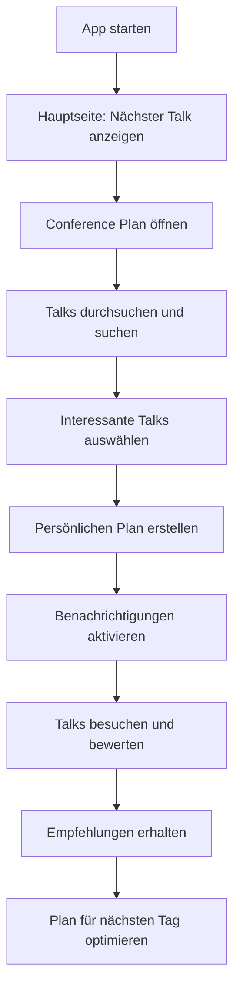

# NdcApp - Conference Planning Application

Eine .NET MAUI-Anwendung zur Planung und Verwaltung von Konferenzteilnahmen.

## 🚀 Features

- **CSV-Import**: Lade Konferenz-Talks aus CSV-Dateien
- **Talk-Auswahl**: Wähle interessante Talks für deinen persönlichen Plan
- **Sortierung**: Sortiere nach Sprecher, Kategorie oder chronologisch
- **Persistierung**: Deine Auswahl wird automatisch gespeichert
- **Nächster Talk**: Siehe auf einen Blick, welcher Talk als nächstes ansteht
- **NDC-Design**: Ansprechendes UI im NDC-Corporate-Design

## 📱 Screenshots und UI-Übersicht

### Hauptseite (Main Page)
Die Startseite der App begrüßt Sie im eleganten NDC-Design mit dunkelblauen und gelben Akzentfarben:

```
┌─────────────────────────────────────────┐
│              [NDC Logo]                 │
│                                         │
│           NDC Copenhagen               │
│    Experience the future of software!  │
│                                         │
│  ┌─────────────────────────────────┐    │
│  │   Current Time: 09:00           │    │
│  │   Next Talk: Keynote: AI is     │    │
│  │   having its moment ... again   │    │
│  └─────────────────────────────────┘    │
│                                         │
│    [Go to My Conference Plan]          │
│                                         │
└─────────────────────────────────────────┘
```

**Features der Hauptseite:**
- **Aktuelle Zeit**: Zeigt die aktuelle Uhrzeit an
- **Nächster Talk**: Übersicht über den nächsten geplanten Talk
- **NDC-Branding**: Authentisches NDC Copenhagen Design
- **Zentrale Navigation**: Direkter Zugang zum Conference Plan

### Conference Plan Seite
Die Hauptarbeitsseite für die Talk-Verwaltung:

```
┌─────────────────────────────────────────┐
│           Conference Plan               │
│                                         │
│  [Search talks, speakers, categories...] │
│                                         │
│ [Alle Talks] [Meine Talks] [🔔] [Sort▼] │
│                                         │
│  ┌─────────────────────────────────┐    │
│  │  Keynote: AI is having its...   │    │
│  │  Jodie Burchell                 │    │
│  │  ⭐⭐⭐⭐⭐ (5.0)               │    │
│  │  Wednesday                      │    │
│  │  09:00                          │    │
│  │        [Select Talk]            │    │
│  └─────────────────────────────────┘    │
│                                         │
│  ┌─────────────────────────────────┐    │
│  │  Java Sucks (So C# Didn't Have │    │
│  │  To)                            │    │
│  │  Adele Carpenter                │    │
│  │  ⭐⭐⭐⭐☆ (4.2)               │    │
│  │  Wednesday                      │    │
│  │  10:20                          │    │
│  │        [Select Talk]            │    │
│  └─────────────────────────────────┘    │
│                                         │
└─────────────────────────────────────────┘
```

**Features der Conference Plan Seite:**
- **Suchfunktion**: Volltextsuche über Titel, Sprecher und Kategorien
- **Filter-Buttons**: Schneller Wechsel zwischen allen Talks und persönlicher Auswahl
- **Benachrichtigungen**: Zugang zu Push-Notification-Einstellungen  
- **Sortierung**: Verschiedene Sortieroptionen (Standard, Presenter, Kategorie, Rating)
- **Talk-Karten**: Übersichtliche Darstellung jedes Talks mit:
  - Talk-Titel und Sprecher
  - Bewertungssystem (5-Sterne-Rating)
  - Zeitangaben (Tag und Uhrzeit)
  - Auswahl-Buttons für persönlichen Plan
- **Swipe-Gesten**: Wischen nach rechts für schnelle Talk-Auswahl
- **Pull-to-Refresh**: Ziehen Sie nach unten um Daten zu aktualisieren

## 🏗️ Projektstruktur

```
NdcApp/
├── NdcApp/                 # Haupt-MAUI-Anwendung
│   ├── MainPage.xaml       # Startseite mit Next-Talk-Info
│   ├── ConferencePlanPage.xaml # Talk-Auswahl und -Verwaltung
│   └── Converters/         # UI-Konverter
├── NdcApp.Core/           # Business Logic
│   ├── Models/            # Talk-Datenmodell
│   └── Services/          # CSV-Service, Plan-Service
└── NdcApp.Tests/          # Umfangreiche Test-Suite (52 Tests)
```

## 📖 Benutzerhandbuch

> 📋 **Ausführliche Anleitung**: Für eine detaillierte Schritt-für-Schritt Anleitung siehe [BENUTZERHANDBUCH.md](BENUTZERHANDBUCH.md)

### Erste Schritte

**1. App-Start**
- Starten Sie die NdcApp auf Ihrem Gerät
- Sie landen automatisch auf der Hauptseite mit der aktuellen Zeit und dem nächsten Talk

**2. Conference Plan öffnen**
- Tippen Sie auf "Go to My Conference Plan" um zur Hauptarbeitsseite zu gelangen
- Hier sehen Sie alle verfügbaren Talks der Konferenz

### Talk-Verwaltung

**Talks durchsuchen:**
- Verwenden Sie die Suchleiste am oberen Rand
- Suchen Sie nach:
  - Talk-Titeln (z.B. "AI", "Machine Learning")
  - Sprechernamen (z.B. "Jodie Burchell")
  - Kategorien (z.B. "Backend", "Frontend")
  - Räumen (z.B. "Room 1", "Room 2")

**Talks auswählen:**
- **Methode 1**: Tippen Sie auf den "Select Talk" Button unter einem Talk
- **Methode 2**: Wischen Sie einen Talk nach rechts und tippen auf "Select"
- Ausgewählte Talks werden in Ihrem persönlichen Plan gespeichert

**Filter verwenden:**
- **"Alle Talks"**: Zeigt sämtliche verfügbare Talks
- **"Meine Talks"**: Zeigt nur Ihre ausgewählten Talks
- **Sortierung**: Wählen Sie aus verschiedenen Sortieroptionen:
  - Standard (chronologisch)
  - Nach Presenter (alphabetisch)
  - Nach Kategorie
  - Nach Rating (höchste Bewertung zuerst)

**Talk-Bewertungen:**
- Bewerten Sie Talks mit 1-5 Sternen
- Ihre Bewertungen werden gespeichert und bei der Sortierung berücksichtigt
- Sehen Sie Community-Bewertungen anderer Teilnehmer

### Benachrichtigungen

**Push-Notifications einrichten:**
- Tippen Sie auf das 🔔 Symbol im Conference Plan
- Aktivieren Sie Benachrichtigungen für:
  - Anstehende Talks (15 und 5 Minuten vorher)
  - Programm-Änderungen
  - Raum-Wechsel

**Nächster Talk:**
- Auf der Hauptseite sehen Sie immer Ihren nächsten geplanten Talk
- Die Anzeige aktualisiert sich automatisch

### Tipps und Tricks

**Effiziente Nutzung:**
- Planen Sie Ihren Tag im Voraus: Wählen Sie alle interessanten Talks aus
- Nutzen Sie die Suche um ähnliche Themen zu finden
- Bewerten Sie besuchte Talks für bessere Empfehlungen
- Verwenden Sie Swipe-Gesten für schnellere Navigation

**Problemlösung:**
- Pull-to-Refresh: Ziehen Sie die Talk-Liste nach unten um Daten zu aktualisieren
- Bei Synchronisationsproblemen: Schließen und öffnen Sie die App erneut
- Bewertungen werden automatisch gespeichert

## 🛠️ Setup und Installation

### Für Endbenutzer

**Windows-Installation:**
1. Laden Sie die neueste NdcApp-Version von der [Releases-Seite](https://github.com/rsutter98/NdcApp/releases) herunter
2. Öffnen Sie die heruntergeladene `.msix` Datei
3. Folgen Sie den Installationsanweisungen
4. Starten Sie die App über das Startmenü

**Android-Installation:**
1. Laden Sie die `.apk` Datei von der [Releases-Seite](https://github.com/rsutter98/NdcApp/releases) herunter
2. Aktivieren Sie "Installation aus unbekannten Quellen" in den Android-Einstellungen
3. Öffnen Sie die `.apk` Datei und installieren Sie die App
4. Starten Sie die NdcApp über das App-Drawer

**Apple/iOS-Installation:**
1. **TestFlight (Empfohlen):**
   - Installieren Sie die TestFlight App aus dem App Store (falls noch nicht vorhanden)
   - Öffnen Sie den bereitgestellten TestFlight-Einladungslink
   - Folgen Sie den Anweisungen zur Installation der Beta-Version
   - Starten Sie die NdcApp über das Home-Bildschirm

2. **Direkte Installation (Entwickler):**
   - Laden Sie die `.ipa` Datei von der [Releases-Seite](https://github.com/rsutter98/NdcApp/releases) herunter
   - Verwenden Sie Xcode oder ein Tool wie 3uTools zur Installation
   - Vertrauen Sie dem Entwicklerzertifikat in den iOS-Einstellungen (Einstellungen > Allgemein > VPN & Geräteverwaltung)
   - Starten Sie die NdcApp über das Home-Bildschirm

**Systemanforderungen:**
- **Windows**: Windows 10 Version 1903 oder höher
- **Android**: Android 7.0 (API Level 24) oder höher
- **iOS**: iOS 11.0 oder höher
- **Speicherplatz**: Mindestens 50 MB freier Speicherplatz
- **Internetverbindung**: Für CSV-Updates und Synchronisation

### Für Entwickler

### Voraussetzungen

- .NET 8.0 SDK
- Visual Studio 2022 mit MAUI-Workload oder
- Visual Studio Code mit C# Dev Kit

### Entwicklungsumgebung einrichten

1. **Repository klonen**
   ```bash
   git clone https://github.com/rsutter98/NdcApp.git
   cd NdcApp
   ```

2. **Dependencies installieren**
   ```bash
   dotnet restore
   ```

3. **Build ausführen**
   ```bash
   dotnet build
   ```

4. **Tests ausführen**
   ```bash
   dotnet test
   ```

5. **App starten** (für Windows)
   ```bash
   dotnet run --project NdcApp --framework net8.0-windows10.0.19041.0
   ```

### CSV-Datenformat

Die App erwartet CSV-Dateien mit folgendem Format:

```csv
Day,StartTime,EndTime,Room,Title,Speaker,Category
Monday,09:00,10:00,Room A,Keynote: The Future of AI,John Doe,Keynote
Monday,10:30,11:30,Room B,Building Modern APIs,Jane Smith,Backend
...
```

**Spalten:**
- `Day`: Wochentag (Monday, Tuesday, ...)
- `StartTime`: Startzeit (HH:MM Format)
- `EndTime`: Endzeit (HH:MM Format)
- `Room`: Raum-Bezeichnung
- `Title`: Talk-Titel
- `Speaker`: Sprecher-Name
- `Category`: Kategorie/Track

## 🧪 Testing

Das Projekt verfügt über eine umfangreiche Test-Suite:

- **52 Tests** decken alle Core-Funktionalitäten ab
- **Unit Tests** für Business Logic
- **Integration Tests** für End-to-End-Szenarien
- **UI-Converter Tests** für XAML-Bindings

```bash
# Alle Tests ausführen
dotnet test

# Tests mit detaillierter Ausgabe
dotnet test --verbosity detailed

# Spezifische Test-Klasse ausführen
dotnet test --filter "ClassName=TalkServiceTests"
```

## 🚀 Deployment

### Android
```bash
dotnet publish NdcApp -f net8.0-android -c Release
```

### Windows
```bash
dotnet publish NdcApp -f net8.0-windows10.0.19041.0 -c Release
```

### iOS
```bash
dotnet publish NdcApp -f net8.0-ios -c Release
```

## 🔄 UI-Workflow und Benutzerreise

### Typischer Tagesablauf mit der NdcApp



### Detaillierter Workflow

**Phase 1: Vorbereitung (vor der Konferenz)**
1. **App installieren und starten**
   - Erste Orientierung auf der Hauptseite
   - Überblick über das nächste Event

2. **Conference Plan erkunden**
   - Alle verfügbaren Talks durchblättern
   - Suchfunktion für spezielle Interessen nutzen
   - Filter nach Kategorien anwenden

3. **Persönlichen Plan erstellen**
   - Interessante Talks mit "Select" hinzufügen
   - Mögliche Überschneidungen identifizieren
   - Plan mit "Meine Talks" überprüfen

**Phase 2: Während der Konferenz**
1. **Morgens**: 
   - Hauptseite checken → nächster Talk
   - Benachrichtigungen aktivieren
   - Tagesplan mit "Meine Talks" überprüfen

2. **Zwischen den Talks**:
   - Besuchte Talks bewerten (1-5 Sterne)
   - Spontan interessante Talks hinzufügen
   - Nächsten Talk auf Hauptseite checken

3. **Abends**:
   - Alle besuchten Talks bewerten
   - Plan für nächsten Tag anpassen
   - Empfehlungen basierend auf Bewertungen ansehen

**Phase 3: Nach der Konferenz**
1. **Nachbereitung**:
   - Finales Rating aller besuchten Talks
   - Persönlichen Konferenz-Rückblick
   - Plan für zukünftige Events optimieren

### Interaktions-Muster

**Haupt-Navigation:**
```
Hauptseite ←→ Conference Plan
    ↓            ↓
Nächster Talk   Talk-Verwaltung
```

**Talk-Auswahl Workflow:**
```
Talk finden → Bewerten → Auswählen → Zu "Meine Talks" → Benachrichtigungen
```

**Such- und Filter-Pattern:**
```
Alle Talks → Suche eingeben → Filter anwenden → Ergebnisse → Auswahl treffen
```

### Benutzerfreundlichkeit Features

**Schnelle Aktionen:**
- Swipe nach rechts: Talk auswählen
- Swipe nach links: Talk abwählen  
- Pull-to-Refresh: Daten aktualisieren
- Tap auf Sterne: Bewertung abgeben

**Visuelle Orientierungshilfen:**
- Farbkodierung: Ausgewählte vs. nicht-ausgewählte Talks
- Icons: Benachrichtigungs-Symbol, Sortier-Dropdown
- Sternen-Rating: Sofortige Bewertungsübersicht
- NDC-Branding: Konsistente Designsprache

**Automatische Features:**
- Auto-Update der "Nächster Talk" Anzeige
- Persistierung aller Auswahlen und Bewertungen
- Push-Notifications zur richtigen Zeit
- Intelligente Sortierung nach Bewertungen

## 📋 Bekannte Probleme

- XAML-Binding-Warnungen (geplant zu beheben)
- Performance bei sehr großen CSV-Dateien nicht getestet

## 🗺️ Roadmap

Siehe [ROADMAP.md](ROADMAP.md) für detaillierte Informationen zu geplanten Features und nächsten Schritten.

### Nächste Features
- Such-/Filter-Funktionalität
- Push-Benachrichtigungen für anstehende Talks
- Dark Mode
- Multi-Konferenz-Unterstützung

## 🤝 Beitragen

1. Fork das Repository
2. Erstelle einen Feature-Branch (`git checkout -b feature/amazing-feature`)
3. Committe deine Änderungen (`git commit -m 'Add amazing feature'`)
4. Push zum Branch (`git push origin feature/amazing-feature`)
5. Öffne eine Pull Request

### Entwicklungsrichtlinien

- Alle neuen Features benötigen Tests
- Code-Style entsprechend bestehender Konventionen
- XAML-Bindings mit x:DataType für Performance
- Deutsche Kommentare und UI-Texte (NDC Copenhagen Context)

## 📄 Lizenz

*Lizenz-Information folgt*

## 📚 Dokumentations-Wartung

### Für Entwickler und Mitwirkende

**Bei jedem Issue/Feature:**
- Aktualisieren Sie diese README.md wenn neue Features hinzugefügt werden
- Erweitern Sie die FEATURES.md bei neuen Funktionalitäten
- Aktualisieren Sie Screenshots bei UI-Änderungen
- Passen Sie die Benutzerhandbuch-Sektion bei Workflow-Änderungen an

**Dokumentations-Checkliste für Pull Requests:**
- [ ] README.md auf Aktualität geprüft
- [ ] Screenshots bei UI-Änderungen aktualisiert
- [ ] Benutzerhandbuch bei neuen Features erweitert
- [ ] Links auf Funktionalität getestet
- [ ] Deutsche Übersetzungen korrekt

**Datei-Struktur der Dokumentation:**
- `README.md` - Haupt-Dokumentation mit Benutzerhandbuch
- `BENUTZERHANDBUCH.md` - Ausführliche Anleitung für Endbenutzer (Deutsch)
- `FEATURES.md` - Detaillierte Feature-Liste und Roadmap-Ideen  
- `ROADMAP.md` - Entwicklungsplan und nächste Schritte
- `NOTIFICATIONS.md` - Spezifische Dokumentation für Push-Notifications
- `TEST_README.md` - Testing-Dokumentation

### Sprachen und Zielgruppen

**Dokumentations-Sprachen:**
- **Deutsch**: Haupt-Benutzersprache (NDC Copenhagen Kontext)
- **Englisch**: Technische Begriffe und Code-Kommentare
- **Gemischt**: Angemessen für internationale Entwickler-Community

**Zielgruppen:**
- **Endbenutzer**: Konferenzteilnehmer (README.md Benutzerhandbuch)
- **Entwickler**: Contributors und Maintainer (technische Abschnitte)
- **Event-Organisatoren**: Potentielle Anwender für andere Konferenzen

## 📞 Support

## 📞 Support und Hilfe

### Häufige Probleme und Lösungen

**Problem: App startet nicht**
- Überprüfen Sie die Systemanforderungen
- Starten Sie das Gerät neu
- Deinstallieren und neu installieren Sie die App

**Problem: Talks werden nicht angezeigt**
- Überprüfen Sie die Internetverbindung
- Verwenden Sie Pull-to-Refresh in der Talk-Liste
- Stellen Sie sicher, dass eine gültige CSV-Datei geladen wurde

**Problem: Benachrichtigungen funktionieren nicht**
- Prüfen Sie die App-Berechtigungen für Benachrichtigungen
- Aktivieren Sie Benachrichtigungen in den Geräte-Einstellungen
- Überprüfen Sie die "Nicht stören" Einstellungen

**Problem: Bewertungen werden nicht gespeichert**
- Stellen Sie sicher, dass die App vollständig geladen ist
- Verwenden Sie Pull-to-Refresh und prüfen Sie erneut
- Bei anhaltenden Problemen: App neu starten

### Kontakt und Feedback

**GitHub Issues:**
- Für Bugs: [Bug Report erstellen](https://github.com/rsutter98/NdcApp/issues/new?template=bug_report.md)
- Für Features: [Feature Request erstellen](https://github.com/rsutter98/NdcApp/issues/new?template=feature_request.md)
- Für Dokumentation: Label `documentation` verwenden

**Community:**
- Diskussionen: [GitHub Discussions](https://github.com/rsutter98/NdcApp/discussions)
- Code-Reviews: Pull Requests sind willkommen

**Datenquellen:**
- CSV-Format-Probleme: Siehe Abschnitt "CSV-Datenformat" oben
- Beispiel-Daten: Verfügbar in `Resources/Raw/ndc.csv`

Bei Fragen oder Problemen erstellen Sie bitte ein Issue im GitHub-Repository.

---

**Status**: Aktive Entwicklung  
**Version**: 1.0.0-preview  
**Zielplattformen**: Android, Windows, iOS  
**Letzte Aktualisierung**: Januar 2025